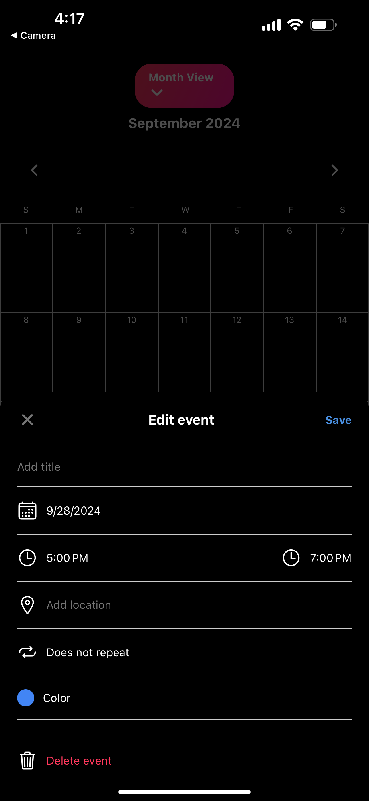
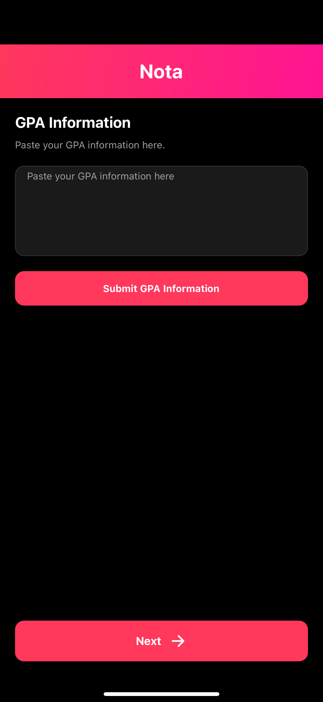
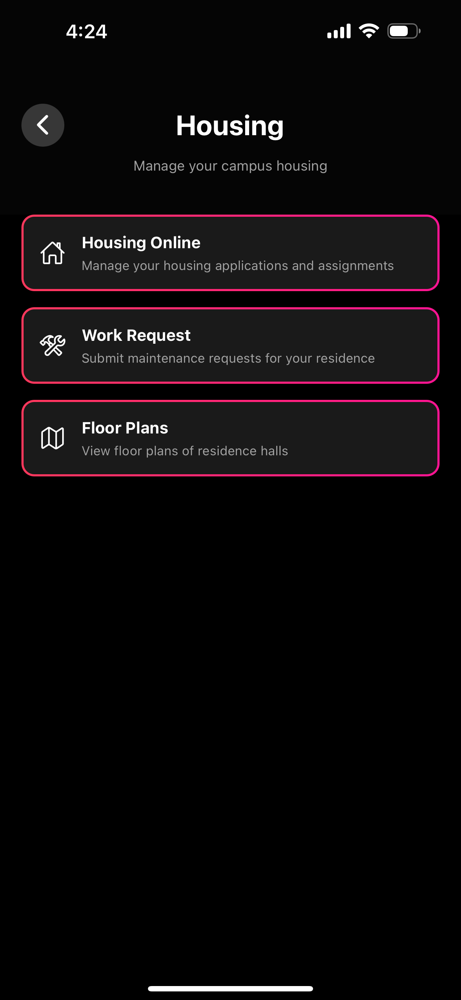

# Nota - Everything App for Students

Nota is a comprehensive mobile application designed to simplify university life for students. It provides a centralized platform for managing academic tasks, tracking progress, and accessing various university resources.

## Main Pages Overview

Here's a glimpse of Nota's main pages:

  
  
  
  
    
    
    
    
  
  

## Key Features
- Seamless Integration
- Course management
- Assignment tracking
- GPA calculation
- Academic calendar
- Goal setting and tracking
- University resources access
- Personalized insights with Claude API

To migrate to my app a student just needs to copy and paste their schedule's and transcripts; this info is then parsed using Claude's API called by AWS lambda to then put the needed information into appwrite.
Here's a quick look at how seamless moving to this app as a student is:

  
  
  
  
  
  

## Technology
Built with React Native and Appwrite, Nota offers a seamless mobile experience for both Android and iOS platforms.
Utilizes the popular LLM Anthropic's Claude API for intelligent responses to user queries. Using AWS Lambda to make calls to Claude.

## How It Works
Here's a brief overview of how Nota helps students manage their academic life:

1. **Course Management**

  
  

2. **Assignment Tracking**

  

3. **GPA Calculation**

  

4. **Student Resources**

  
  
  
  
  
  

## Demo Video
Check out my full demo video to see Nota in action:

## Made by
me (Anthony Campos) lol
